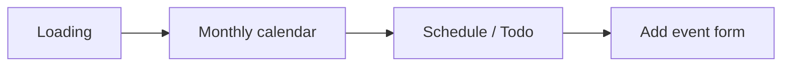

# OneMonth

한 달의 분위기와 일정을 한 화면에 담는 React Native 캘린더 UI
프로토타입입니다. 월별 일러스트, 달력, 시간순 일정, 카테고리별 할 일을
하나의 모바일 화면에 구성하고 상세 일정 입력 흐름을 탐색했습니다.

## 주요 화면과 기능

- 로딩 화면에서 월간 캘린더로 이어지는 navigation
- 월 선택에 따라 바뀌는 배경 이미지와 테마 색상
- 선택한 날짜의 일정을 시작 시간 기준으로 정렬
- 일정 삭제 도움말과 새 일정 화면 전환
- 카테고리별 todo 목록 및 완료 상태 toggle
- 제목, 양력/음력, 시간, 장소, 알림, 반복 요일, 메모, 색상을 포함한
  일정 입력 UI



## 기술 스택

- React Native 0.70
- React 18
- React Navigation
- react-native-calendars
- JavaScript

## 실행

React Native 0.70 개발 환경과 Android Studio 또는 Xcode가 필요합니다.

```bash
npm install
npm start

# 별도 터미널
npm run android
# 또는
npm run ios
```

플랫폼별 SDK와 simulator 설정은
[React Native 환경 구성 문서](https://reactnative.dev/docs/environment-setup)를
참고하세요. 저장소가 2022년 dependency를 사용하므로 최신 Node.js/JDK/Xcode
환경에서는 version 조정이 필요할 수 있습니다.

## 프로젝트 구조

| 경로 | 내용 |
|---|---|
| `assets/App.js` | 화면 navigation |
| `assets/CalendarScene/` | 월간 달력, 일정, todo, 테마 UI |
| `assets/AddEventScene/` | 일정 입력 form과 색상 palette |
| `assets/Images/` | 12개월 테마 이미지 |
| `android/`, `ios/` | React Native native project |

## 설계 포인트

- 화면을 `CalendarScene`과 `AddEventScene`으로 분리해 사용자 흐름과
  component 책임을 맞췄습니다.
- 월 선택 상태는 Context로 공유하고, 일정·todo의 작은 interaction은
  각 component의 local state로 격리했습니다.
- 긴 일정 입력 화면은 단계별 form component로 나눠 수정 가능한 구조로
  만들었습니다.

## 현재 상태

UI와 interaction을 검증하기 위한 프로토타입입니다. 일정과 todo는 예시
데이터 및 메모리 상태를 사용하며 영구 저장, 동기화, 알림 발송, 입력값을
실제 일정 목록에 반영하는 기능은 구현되어 있지 않습니다.
